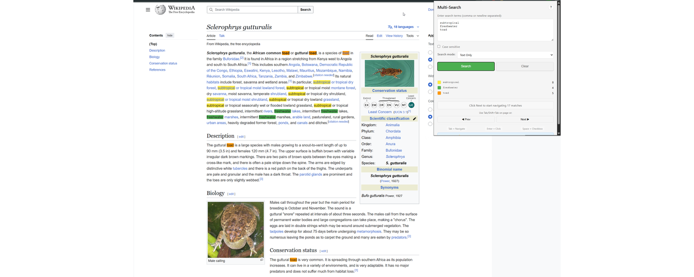
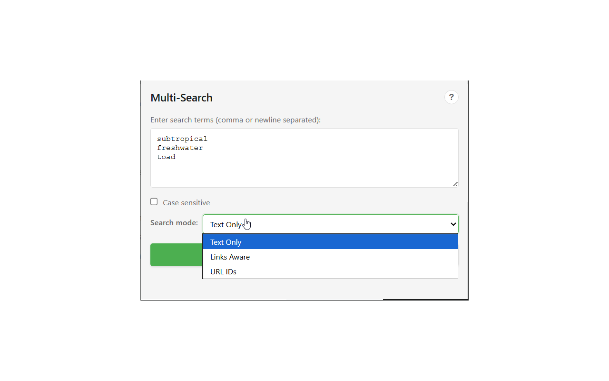
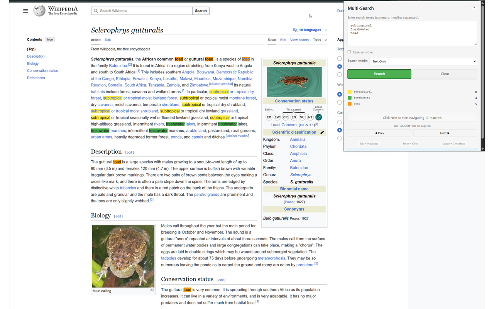

# Multi-Search Chrome Extension

A powerful Chrome extension for searching and highlighting multiple terms simultaneously on any webpage. Color-coded results make it easy to track multiple items at once.



## Features

- **Multi-Color Highlighting**: Search multiple terms at once, each with a unique color (up to 8 colors)
- **Smart Search Modes**:
  - **Text Only**: Traditional text search across the page
  - **Links Aware**: Highlight entire links when text matches
  - **URL IDs**: Extract and match numeric IDs from URLs
- **Keyboard Navigation**:
  - Tab/Shift+Tab to navigate between matches
  - Enter to click links
  - Space to toggle checkboxes
- **Session Persistence**: Searches saved until tab closes
- **Fast Performance**: Handles 100+ search terms efficiently

## Installation

### Quick Install (Recommended)
**→ [Download Extension ZIP](https://github.com/ahhhdum/chrome-multi-search/raw/main/dist/chrome-multi-search.zip)** *(Right-click → Save Link As)*

1. Download the ZIP file using the link above
2. Open Chrome and go to `chrome://extensions`
3. Enable "Developer mode" (toggle in top right)
4. Drag the downloaded ZIP file onto the Chrome extensions page
5. Done! Click the extension icon in your toolbar to start searching

### From Chrome Web Store
Coming soon! (Pending review)

### Manual Installation (For Developers)
1. Clone this repository or download source code
2. Open Chrome and navigate to `chrome://extensions`
3. Enable "Developer mode" (top right)
4. Click "Load unpacked"
5. Select the extension folder

For detailed instructions with screenshots, see [INSTALL.md](INSTALL.md).

## How to Use

### Basic Usage



1. Click the extension icon in your toolbar (or press `Ctrl+Shift+F`)
2. Enter search terms (comma or newline separated)
3. Select search mode:
   - **Text Only** for general text search
   - **Links Aware** to highlight entire link elements
   - **URL IDs** for finding numeric IDs in URLs
4. Click "Search"
5. Navigate matches with Tab/Shift+Tab

### Example Result



### Keyboard Shortcuts
- **Ctrl+Shift+F** (Cmd+Shift+F on Mac): Open search panel
- **Tab**: Next match
- **Shift+Tab**: Previous match
- **Enter**: Click focused link
- **Space**: Toggle checkbox in row
- **Escape**: Clear all highlights
- **Ctrl+Shift+S**: Toggle highlight visibility

### Use Cases
- **Research**: Track multiple topics or keywords in documents
- **QA Testing**: Verify multiple IDs or elements on a page
- **Data Analysis**: Find patterns across large datasets
- **Content Review**: Check for specific terms in articles
- **Bulk Operations**: Select multiple items by ID for batch processing

## Development

### Project Structure
```
chrome-multi-search/
├── manifest.json          # Extension configuration
├── src/
│   ├── background/       # Service worker
│   ├── content/         # Main search logic
│   ├── popup/          # Extension UI
│   └── shared/         # Shared constants
├── icons/              # Extension icons
└── dev/               # Development tools
```

### Technical Details
- **Manifest V3** Chrome extension
- **No external dependencies** - pure JavaScript
- **Session storage** for persistence
- **MutationObserver** for dynamic content
- **Clean, well-organized code**

### Building
```bash
# Create zip for Chrome Web Store
zip -r extension.zip manifest.json src/ icons/
```

## Contributing

Contributions are welcome! Please feel free to submit a Pull Request.

## Version History

### v1.0.0
- Initial release with all core features
- Multi-term search with color coding
- Three search modes
- Keyboard navigation and interaction
- Session persistence

## Privacy

This extension does not collect any user data. All searches are performed locally in your browser. See [PRIVACY.md](PRIVACY.md) for details.

## License

MIT License - see LICENSE file for details

## Support

For issues or feature requests, please visit the [GitHub repository](https://github.com/ahhhdum/chrome-multi-search).